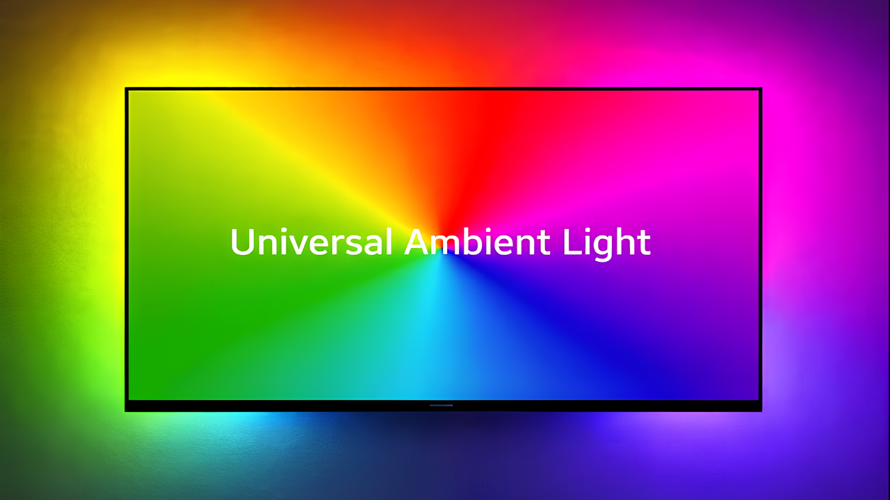

# Universal Ambient Light – Fire TV Edition

Ambient screen lighting for **Amazon Fire TV** devices. This fork captures the Fire TV screen, extracts edge colors, and streams them to a WLED / Hyperion / Adalight LED controller.

Optimized for **Fire TV OS 6.7+** (Stick, Stick 4K, Cube, etc.).

> Based on: [vasmarfas/universal-ambient-light](https://github.com/vasmarfas/universal-ambient-light)

[Читать на русском](README_RU.md) · [Support the project](SUPPORT.md) ·
[Third-party licenses](THIRD_PARTY_LICENSES.md)

---

## What’s different in this fork

- **Fire TV–focused build**
  - `minSdkVersion` / `targetSdkVersion` tuned for **Fire TV OS 6.7+**.
  - ARM‑only ABI filters (`armeabi-v7a`, `arm64-v8a`) for Fire Stick / Cube hardware.
- **Manifest & service fixes for Fire TV**
  - Declared `FOREGROUND_SERVICE_MEDIA_PROJECTION` permission.
  - Set `android:foregroundServiceType="mediaProjection"` on the screen‑capture service.
  - Marked `touchscreen` and `leanback` features as `required="false"` for TV use.
- **Sideloading‑friendly**
  - Signed release APK with a stable keystore.
  - Tested installation via ADB on Fire TV devices running Fire TV OS 6.7 and newer.
- **No functional changes to core logic**
  - WLED / Hyperion / UDP / Adalight protocols unchanged.
  - UI and settings screens identical to upstream; only build config and manifest modified for Fire TV OS compatibility.

---

## Features

- **Three controller families**: Hyperion, WLED and Adalight.
- **Fire TV / Android TV optimized**: D‑pad navigation, TV‑friendly layouts.
- **Camera capture**: films the TV with a phone/tablet camera and corrects perspective by four corners — useful when screen capture is blocked (e.g., DRM content).
- **Network discovery**: scans the local network for LED servers.
- **Tunable pipeline**: capture quality, frame rate, color smoothing and latency.
- **Auto-start** on device boot and **auto-reconnect** after a connection drop.
- **Average color mode**: sends one dominant color instead of a full strip, for weak devices.
- **Quick Settings tile** for switching the light on and off (where supported).

---

## Supported Controllers

### Hyperion
- Full Hyperion protocol support.
- Message priority configuration.
- Compatible with all Hyperion NG versions.

### WLED
- Supports **DDP** (recommended for WLED 0.11+) and **UDP Raw** protocols.
- Configurable color order (RGB, GRB, BRG, etc.).
- RGBW LED support.
- Brightness control.

### Adalight
- Supports **ADA**, **LBAPA** (LightBerry APA102), and **AWA** (Hyperserial) protocols.
- Configurable Baud Rate.
- USB OTG connection support (for devices that support USB host).

---

## Requirements

- **Amazon Fire TV device** (Stick, Stick 4K, Cube, etc.) running **Fire TV OS 6.7 or newer**.
- **Developer Options** enabled:
  - ADB Debugging ON.
  - Install from unknown sources allowed (for sideloading).
- Screen Capture permission (MediaProjection) for screen mode.
- Local network access (for Hyperion/WLED) or USB Host support (for Adalight, where applicable).

---

## Installation (Fire TV)

### From GitHub Releases

1. Download the latest **Fire TV APK** from the [Releases page](https://github.com/YOUR_USERNAME/universal-ambient-light-firetv/releases).
   - Look for assets like `universal-ambient-light-<version>-firetv.apk`.
2. On your Fire TV:
   - Go to **Settings → My Fire TV → About**.
   - Highlight the device name and press **Select** 7 times to enable **Developer Options**.
   - Go back → **Developer Options** → enable **ADB Debugging**.
   - Note the IP under **Network**.
3. On your PC:
   - Install ADB / platform‑tools if you haven’t already.
   - Connect to the Fire TV:
     ```bash
     adb connect <FIRE_TV_IP>:5555
     ```
   - Install the APK:
     ```bash
     adb install -r universal-ambient-light-<version>-firetv.apk
     ```
4. On Fire TV:
   - Open **Universal Ambient Light** from **Your Apps & Channels**.
   - Grant **Screen Capture** permission when prompted.

> If you prefer, you can also sideload via a downloader app on the Fire TV by entering the direct APK URL from the Releases page.

---

## Configuration

### 1. Connection

1. Launch the app and open **Settings**.
2. Select **Connection Type**: Hyperion, WLED, or Adalight.
3. Enter the IP/Port (for network controllers) or configure USB settings.

**Typical WLED settings:**

- **Host**: `<WLED_ESP_IP>`
- **Port**:
  - `4048` for **DDP** (recommended), or
  - `19446` / `21324` for **UDP Raw** (depending on your WLED config).
- **Protocol**: DDP (preferred for WLED 0.11+).
- **Color Order**: must match your WLED strip (e.g., GRB for WS2812B).

---

### 2. LED Configuration

- **Per-Side LED Configuration**: configure each side separately:
  - Top: e.g. 60 LEDs (default)
  - Right: e.g. 34 LEDs (default)
  - Bottom: e.g. 60 LEDs (default)
  - Left: e.g. 34 LEDs (default)
- **LED Layout**: configure starting corner, direction (clockwise/counterclockwise), and enable/disable individual sides.

Make sure the total LED count and order match your physical strip and WLED configuration.

---

### 3. Capture Settings

- **Capture Source**:
  - **Screen** (default): uses MediaProjection API (requires screen capture permission).
  - **Camera**: uses a phone/tablet camera with perspective correction; ideal when screen capture is blocked (e.g., DRM content) or unavailable.
- **Capture Rate (FPS)**: default 30 FPS (options: 10, 15, 24, 30, 60).
- **Capture Quality**:
  - *Low (64px)* — for low‑end devices or minimal latency.
  - *Medium (128px)* — balanced (default, recommended).
  - *High (256px)* — for powerful devices.
  - *Ultra (512px)* — maximum quality for high‑end devices.
- **Send Average Color**: enable for maximum performance (sends a single color for the whole strip).

---

### 3.1. Camera Mode Setup

When using **Camera** as the capture source:

1. Grant **Camera** permission when prompted (on the phone/tablet running the app).
2. Open **Settings → Camera Corner Setup**.
3. Position your device so the camera can see the TV screen.
4. Drag the four corner markers (TL, TR, BR, BL) to match the edges of your TV screen.
5. Tap **Save** to store the corner positions.
6. The app will use these corners for perspective correction during capture.

**Tips:**

- Use the live preview on the main screen to calibrate your device position before starting capture.
- Ensure good lighting so the camera can clearly see the TV screen.
- The corner adjustment helps compensate for non‑square camera placement relative to the TV.

**“Find the TV”** in Camera Corner Setup tries to place the corners automatically. For four seconds it watches the frame, distinguishing a lit panel from the room by brightness and a TV from a lamp or window by whether the picture changes, then loads the result into the overlay — nothing is saved until you press **Save**. The strip is held dark while measuring, otherwise its own glow on the wall reads as part of the screen.

Treat it as a starting point rather than a finished setting: it outlines the lit picture and not the panel itself, gets confused in a brightly lit room, and the corners usually need nudging by hand afterwards. When it finds nothing it says why, and the saved corners stay untouched; the detailed reason goes to logcat under `AutoFrameDetection` and `CameraEncoder`.

---

### 3.2. Camera Sleep Mode

Camera capture receives no standby signal from the TV, so a powered‑off screen keeps streaming sensor noise to the strip. The **Camera Sleep Mode** settings group (visible only when the capture source is set to **Camera**) monitors the calibrated screen area and suspends the capture pipeline once there is nothing new to display. Disabled by default.

- **Enable sleep mode**: master switch for the feature.
- **Sleep delay (seconds)**: how long the picture must remain blank before the strip turns off. Range: 5–3600 seconds, default 120. Lower it for a faster response; raise it if dark scenes trigger sleep mode.
- **Blank screen threshold (0–96)**: average brightness of the monitored area at or below which the screen is considered blank. Default: 12. Increase it if a powered‑off TV is not detected.
- **Motion sensitivity threshold (1–64)**: the minimum picture change required to count as motion. Default: 4. Increase it if sensor noise repeatedly wakes the strip.
- **Sleep on a static picture**: also suspends frame transmission when the picture stops changing (paused video, static menu); the strip retains its last colors. Disabled by default, as an extended static scene will freeze the strip's colors.

While in sleep mode, the camera remains bound but is sampled at 5 Hz over a sparse luminance grid instead of running the full perspective‑correction pipeline. Waking requires two consecutive samples above the threshold, so a single noisy frame cannot flash the strip. All four settings can be adjusted while capture is running, since they can only be calibrated against a live feed.

---

### 4. Smoothing

- **Enable Smoothing**: enabled by default. Reduces LED flickering.
- **Preset**: “Balanced” (default). Options: Off, Responsive, Balanced, Smooth.
- **Settling Time**: 200 ms (default, range: 50–500 ms).
- **Output Delay**: 2 frames (default, range: 0–10).
- **Update Frequency**: 25 Hz (default, options: 20, 25, 30, 40, 50, 60 Hz).

---

### 5. Launch

1. Grant **Screen Capture / Casting** permission when prompted (for Screen mode).
2. Toggle the button to start the grabber.

---

## Controller-Specific Details

### Hyperion

- **Host/Port**: server IP and port (default `19400`).
- **Priority**: `100` (default).
- [Hyperion Documentation](https://docs.hyperion-project.org/)

---

### WLED

- **Host**: controller IP.
- **Port**:
  - `4048` (DDP, recommended),
  - `19446` (UDP Raw, WLED’s Hyperion input),
  - or `21324` (UDP Raw, WLED’s own realtime port).
- **Protocol**: DDP (preferred).
- **Color Order**: ensure this matches your WLED settings (e.g., GRB for WS2812B).
- **RGBW**:
  - Works over DDP at any strip length.
  - Over UDP Raw on port `21324` (DRGBW, up to 367 LEDs).
  - Port `19446` is WLED’s Hyperion input: raw RGB only, no white channel, capped at 490 LEDs.

The app extracts the white channel itself (the component common to R, G and B is moved to W), so in WLED:

- Strip type must be **RGBW**.
- **Calculate white channel from RGB** must be set to `Manual only` or `Dual`.

In automatic modes WLED discards the received white value and recomputes it from the already‑reduced RGB, which comes out as zero: the white LEDs stay dark and the colors look washed out.

- [WLED Documentation](https://kno.wled.ge/)

---

### Adalight (USB)

- **Baud Rate**: `115200` (default) or match your firmware.
- **Protocol**: ADA (Standard Arduino), LBAPA (APA102), AWA.
- [Adalight Repository](https://github.com/adafruit/Adalight)

#### Arduino Sketch for Adalight

A ready‑to‑use Arduino sketch compatible with the app is available in [`adalight-sketch.ino`](adalight-sketch/adalight-sketch.ino).

**Quick Start:**

1. **Install FastLED library:**
   - In Arduino IDE: `Tools → Manage Libraries` → search for “FastLED” → install.

2. **Configure the sketch:**
   - Open `adalight-sketch/adalight-sketch.ino`.
   - Modify constants at the top:
     - `DATA_PIN` — pin for LED strip connection (default 6).
     - `NUM_LEDS` — number of LEDs in the strip (must match app settings!).
     - `LED_TYPE` — LED strip type (WS2812B, WS2811, SK6812, etc.).
     - `COLOR_ORDER` — color order (GRB for WS2812B, RGB for others).
     - `BRIGHTNESS` — brightness (0–255).

3. **Wiring:**
   - LED strip DATA → Arduino pin (default 6).
   - LED strip VCC → 5V Arduino (or external power supply for long strips).
   - LED strip GND → GND Arduino.
   - **Important:** For long strips (>10 LEDs), use an external 5V power supply!

4. **Upload sketch:**
   - Connect Arduino to computer via USB.
   - Select board and port in Arduino IDE.
   - Upload the sketch.

5. **Connect to Android / Fire TV (where USB host is supported):**
   - Disconnect Arduino from computer.
   - Connect Arduino to Android device via USB OTG cable.
   - In the app, select connection type: **Adalight**.
   - Set Baud Rate: **115200**.
   - Select protocol: **ADA**.
   - Ensure LED count in the app matches `NUM_LEDS` in the sketch.

**WS2812B Wiring Example:**

```text
WS2812B DATA → Pin 6 Arduino
WS2812B VCC  → 5V Arduino (or external 5V)
WS2812B GND  → GND Arduino
```

**For other LED types:**

- **APA102 (SPI)**: use FastLED library with `APA102` configuration and **LBAPA** protocol in the app.
- **WS2811**: similar to WS2812B, usually `COLOR_ORDER = RGB`.
- **SK6812**: similar to WS2812B, usually `COLOR_ORDER = GRB`.

**Troubleshooting:**

- If LEDs don’t light up: check wiring, ensure `NUM_LEDS` matches in sketch and app.
- If colors are wrong: change `COLOR_ORDER` (try RGB, GRB, BRG).
- If no data received: check Baud Rate (should be 115200), ensure USB OTG cable supports data transfer.

---

## Fire TV / Android TV Features

- Fully optimized for **Android TV / Fire TV**:
  - Leanback Launcher support.
  - D‑pad navigation.
- For easier text entry (IP addresses, etc.), use the **Google TV** or **Android TV Remote** app on your phone.

---

## External Control (KeyMapper, Tasker, remote buttons)

The app exposes a transparent toggle activity that any automation tool able to start an activity can use — for example [KeyMapper](https://github.com/keymapperorg/KeyMapper) to bind a remote button:

- Component:  
  `com.vasmarfas.UniversalAmbientLight/com.vasmarfas.UniversalAmbientLight.common.ToggleActivity`
- Without an action it toggles: stops the light if it is running, otherwise starts it.
- With action:
  - `com.vasmarfas.UniversalAmbientLight.action.TURN_ON` → only starts.
  - `com.vasmarfas.UniversalAmbientLight.action.TURN_OFF` → only stops.

Test from ADB on Fire TV:

```bash
adb shell am start -n com.vasmarfas.UniversalAmbientLight/com.vasmarfas.UniversalAmbientLight.common.ToggleActivity
adb shell am start -a com.vasmarfas.UniversalAmbientLight.action.TURN_OFF
```

Starting still shows the system screen‑capture dialog unless a capture method that does not need MediaProjection is selected (Accessibility, Scrcpy/ADB, Screencap, Camera).

---

## Important Notes

### Fire TV OS 6.7+ Compatibility

This build is specifically tested on **Fire TV OS 6.7** and newer. Older Fire OS versions may work but are not officially supported.

If you encounter installation issues:

- Ensure **Developer Options → ADB Debugging** is enabled.
- Ensure you’re installing the **Fire TV APK** (ARM build).
- Try uninstalling any previous version first:
  ```bash
  adb uninstall com.vasmarfas.UniversalAmbientLight
  adb install -r universal-ambient-light-<version>-firetv.apk
  ```

---

### High-Quality Video Playback (4K/HDR)

Playback issues with high‑quality video (2K/4K/HDR) while the ambient light is active are a hardware limitation of many TVs and set‑top boxes. Built‑in processors often cannot handle simultaneous heavy video decoding and screen capturing. This is a deep‑seated issue that is rarely fixable via software.

**If you experience video stuttering or lag:**

1. Lower the video playback quality to 1080p or 720p (depending on your TV / Fire TV capabilities).
2. Or completely disable the ambient light application while watching high‑resolution content.
3. You can try adjusting capture quality and FPS settings, but it is unlikely to fully solve the issue.

**Black preview where the video should be (4K/HDR, HEVC/VP9 — or *all* video on some devices):**

If your Hyperion/WLED/HyperHDR preview shows a black rectangle where the video should be — while menus, thumbnails, photos and the in‑app test colors capture fine — this is **not** a DRM issue. On Android the video is drawn on a dedicated **hardware video plane (overlay)** that is composited by the display hardware and bypasses SurfaceFlinger; `MediaProjection` only sees what SurfaceFlinger composes, so the video region comes out solid black. Usually this affects only 4K / HEVC 10‑bit / HDR10 / Dolby Vision while regular 1080p goes through the normal stack — **but some devices route _all_ video through the overlay** (e.g. several Sony models), and **on others it depends on the codec rather than the resolution**: on Amlogic boxes HEVC/VP9/AV1 playback comes out black at any resolution while H.264 (AVC) captures perfectly, because those decoders hand AFBC‑compressed frames straight to the video plane. A black *local* file rules out DRM. This is a platform limitation that also affects every other Android ambient‑light tool (Hyperion Android, Lightpack apps, etc.) — there is no fix for the standard `MediaProjection` path, and the `Scrcpy` / `Screencap` / `ADB` methods sit behind SurfaceFlinger too, so they show the same black area.

Workarounds:

1. **Force H.264 (AVC)** if only HEVC/VP9/AV1 goes black: in SmartTube pick the AVC stream instead of VP9; in Jellyfin disable HEVC/AV1 direct play for the client (or cap the bitrate) so the server transcodes to H.264.
2. **Drop the playback to 1080p** in the player/server (Jellyfin → set max bitrate / resolution per device; Kodi → adjust playback settings; mpv → `--hwdec=no` plus `--vo=gpu`). 1080p almost always goes through the regular composition stack.
3. **Disable hardware decoding** in the player (Jellyfin Android: Settings → Player → toggle off "Prefer FMP4" and "Allow background audio playback"; in mpv → `--hwdec=no`). Software decode forces the frame through the composition path, restoring capture.
4. **For rooted devices** — try `Screencap (Root)` or `Screencap (Shell)` capture method in Settings → these go through the `screencap` binary instead of `MediaProjection`, which helps with some capture restrictions; note that `screencap` also reads SurfaceFlinger's output, so it does **not** recover a hardware video plane.
5. **On MediaTek SoC TVs** the experimental `MTK THAL Capture` method captures directly from the vendor DIP engine (before composition), and 4K HDR works there — but requires both root and an MTK chip.

---

### DRM-Protected Content

**DRM‑protected applications** (such as Netflix, Disney+, Amazon Prime Video, and similar streaming services) **will not work** with screen capture mode due to Android's security restrictions. This is a fundamental limitation of the Android MediaProjection API and cannot be bypassed.

**Why this happens:**

- Android blocks screen capture of DRM‑protected content to prevent piracy.
- This is enforced at the system level and cannot be overridden by applications.

**Solutions:**

1. **Use Camera Mode**: switch to **Camera** capture source in settings. This method uses a phone/tablet camera instead of screen capture, so it works with DRM‑protected content. You’ll need to position a phone/tablet with the camera facing the TV screen.
2. **Disable Ambient Light**: turn off the ambient light feature while watching DRM‑protected content.
3. **Use Non‑DRM Sources**: watch content from sources that don’t use DRM protection (local files, YouTube, etc.).

**Note:** Camera mode requires proper calibration of corner positions for accurate color capture.

---

## Building from Source (for developers)

This fork is intended for Fire TV OS 6.7+. If you want to build your own APK:

1. Clone this repository.
2. Open the project in **Android Studio**.
3. Ensure you have:
   - Android SDK with API 34 (or as configured).
   - Build tools installed.
4. Adjust `app/build.gradle` if needed:
   - `minSdkVersion` / `targetSdkVersion` for your Fire OS version.
   - ABI filters: `armeabi-v7a`, `arm64-v8a`.
5. Build a signed APK:
   - **Build → Generate Signed Bundle / APK → APK**.
6. Sideload onto Fire TV via ADB:
   ```bash
   adb connect <FIRE_TV_IP>:5555
   adb install -r app/build/outputs/apk/release/app-release.apk
   ```

Refer to the upstream README for more details on the build process and project structure.

---

## License

See [LICENSE.txt](LICENSE.txt)

---

## Contributing

Contributions are welcome! Please feel free to submit Pull Requests or Report Issues.

If you’re improving Fire TV compatibility, adding Fire‑specific features, or fixing Fire OS bugs, please mention the tested Fire OS version and device in your PR description.
